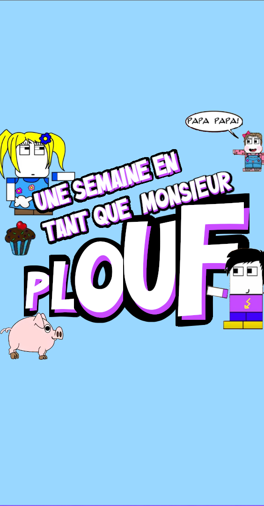
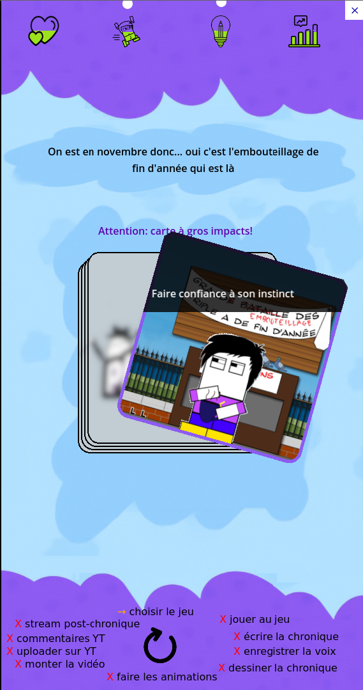
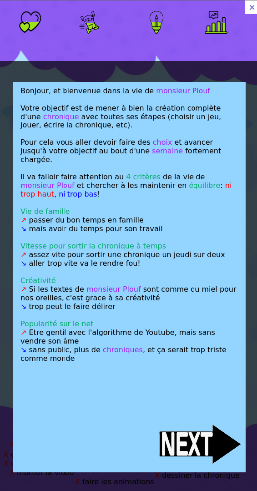
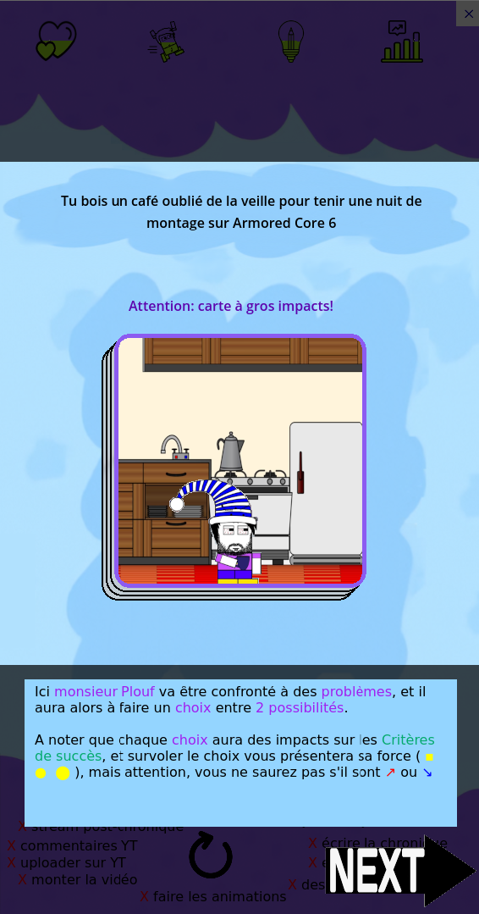
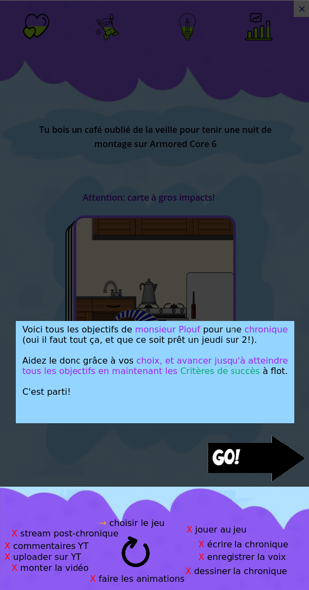
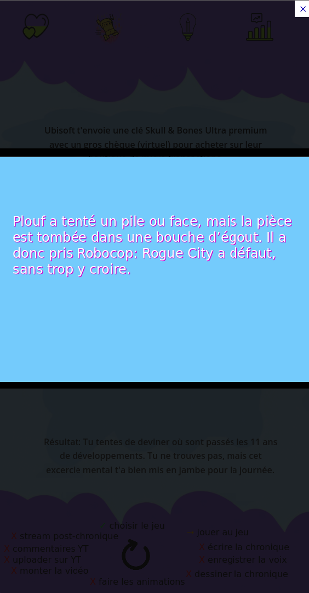

# 🎮 Une semaine dans la vie de Monsieur Plouf

Un fan game humoristique et open source, inspiré de l’univers du vidéaste **Monsieur Plouf**, reprenant le gameplay de **Reigns**.

> 📅 Le but ? Survivre jusqu’au jeudi 18h pour sortir une chronique, tout en résistant à la tentation de jouer à FTL, d’esquiver la fatigue, et de ne pas mourir sous les deadlines.

## 🧩 Le gameplay

Ce jeu repose sur un système de choix binaire, comme dans *Reigns* : à chaque événement, deux options s'offrent à vous. Chaque décision influence quatre jauges représentant des aspects cruciaux de la vie de Plouf (famille, vitesse, créativité et popularité). L'équilibre est la clé !

### 📚 Un mini-tutoriel vous guide :

## 💡 Objectif

Ce n’est **pas** un projet commercial, ni un jeu "fini". C’est un projet **fun**, **communautaire** et **gratuit**, pensé comme un clin d'œil affectueux à l’univers de Monsieur Plouf.

🛠️ Vous pouvez facilement proposer de nouvelles **cartes** d’événements ! Le système est conçu pour être extensible.

## 🔗 Liens utiles

- 🕹️ Version jouable web (rien à installer) : [https://plouf.gabes.fr](https://plouf.gabes.fr)
- 💾 Versions installables (Windows, Linux, Android) : [https://plouf.gabes.fr/builds/](https://plouf.gabes.fr/builds/)
- 🔓 Code source (vous êtes dessus...) : [https://github.com/naparuba/plouf](https://github.com/naparuba/plouf)

## 📸 Aperçus supplémentaires

## ⚠️ Droit d’auteur

- Le projet est **open source**, sous licence libre MIT
- ⚠️ **Les images et musiques utilisées ne sont pas libres de droits** : elles proviennent de captures d’écran issues des vidéos de Monsieur Plouf ou de musiques utilisées dans ses chroniques.
- Un fichier `LICENCE` précisera les restrictions liées à ces contenus tiers.

## 🙋‍♂️ Avertissement / contact

Ce projet est un **hommage personnel**. Si un point vous rends fou et vous énerve, c'est MA faute, et pas celle de Plouf ou de sa modération hein!

Si tu as des idées de cartes ou envie de contribuer, n’hésite pas à ouvrir une issue ou un pull request !

---

🧪 Codé par un fan pour les fans, pour le plaisir, le fun, et un peu de procrastination.
